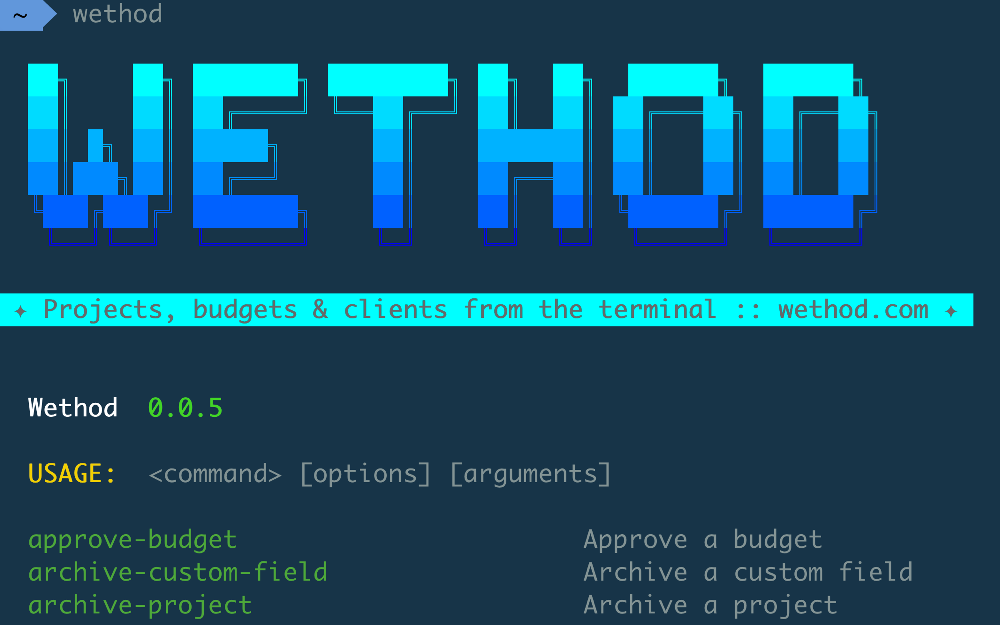

# Wethod CLI

[](https://github.com/enricodelazzari/wethod-cli/releases/latest)
[](https://github.com/enricodelazzari/wethod-cli/actions/workflows/run-tests.yml)
[](https://github.com/enricodelazzari/wethod-cli/actions/workflows/phpstan.yml)
[](LICENSE.md)

A standalone command-line client for the [Wethod API](https://docs.wethod.com/getting-started),
built with [Laravel Zero](https://laravel-zero.com) and
[spatie/laravel-openapi-cli](https://github.com/spatie/laravel-openapi-cli).



Every endpoint in Wethod's [OpenAPI spec](https://docs.wethod.com/specs/openapi.yaml)
becomes its own command — there is no hand-written command per endpoint, so the CLI stays
in sync with the API automatically. Authentication and the required `Wethod-Company` /
`Wethod-Version` headers are added to every request for you.

```bash
wethod login                       # store a token once
wethod list-projects --limit=10    # call any endpoint
wethod create-client --field name="Acme"
```

## Table of contents

- [Requirements](#requirements)
- [Installation](#installation)
- [Authentication](#authentication)
- [Usage](#usage)
- [Multiple companies](#multiple-companies)
- [Configuration](#configuration)
- [Updating](#updating)
- [AI agent skill](#ai-agent-skill)
- [Development](#development)
- [How it works](#how-it-works)
- [Changelog](#changelog)
- [Contributing](#contributing)
- [Security vulnerabilities](#security-vulnerabilities)
- [Credits](#credits)
- [License](#license)

## Requirements

- **PHP 8.4+** (only required when running from source or via the PHAR)
- **Composer** (only required when installing from source)

The prebuilt binaries are self-contained and do **not** require PHP to be installed.

## Installation

### Quick install (recommended)

Run the one-liner for your operating system. It detects your platform, downloads the right
binary from the latest release, and puts `wethod` on your `PATH` — no PHP required.

**macOS**

```bash
/bin/bash -c "$(curl -fsSL https://raw.githubusercontent.com/enricodelazzari/wethod-cli/main/install.sh)"
```

**Linux**

```bash
/bin/bash -c "$(curl -fsSL https://raw.githubusercontent.com/enricodelazzari/wethod-cli/main/install.sh)"
```

**Windows** (PowerShell)

```powershell
irm https://raw.githubusercontent.com/enricodelazzari/wethod-cli/main/install.ps1 | iex
```

> Restart your terminal after installation, then run `wethod --version` to confirm.

The installer honours two environment variables: `WETHOD_INSTALL_DIR` (where to put the
binary) and `WETHOD_VERSION` (a specific release tag instead of the latest).

### Manual download

Prefer not to pipe a script? Download the binary for your platform from the
[latest release](https://github.com/enricodelazzari/wethod-cli/releases/latest), make it
executable, and move it onto your `PATH`. Assets are named `wethod-<version>-<platform>`,
where `<platform>` is one of:

| Platform                | Asset suffix         |
| ----------------------- | -------------------- |
| macOS (Apple Silicon)   | `darwin-arm64`       |
| macOS (Intel)           | `darwin-x64`         |
| Linux (arm64)           | `linux-arm64`        |
| Linux (x64)             | `linux-x64`          |
| Windows (x64)           | `windows-x64.exe`    |

```bash
# Example: macOS (Apple Silicon), release 0.0.4
curl -fSL -o wethod \
  https://github.com/enricodelazzari/wethod-cli/releases/download/0.0.4/wethod-0.0.4-darwin-arm64
chmod +x wethod
sudo mv wethod /usr/local/bin/wethod
```

However you install it, the CLI can keep itself up to date afterwards with
[`wethod self-update`](#updating).

### From source

```bash
git clone https://github.com/enricodelazzari/wethod-cli.git
cd wethod-cli
composer install
```

This creates the `wethod` executable in the project root. Run it with `php wethod` (or
`./wethod`). All examples below use `wethod`; substitute `php wethod` when running from source.

## Authentication

Store your credentials once:

```bash
wethod login
```

You'll be prompted for:

- **Company endpoint** — the subdomain of your Wethod URL (e.g. `acme` from `acme.wethod.com`)
- **API token** — a personal token from your Wethod *Account settings*. It is validated
  against the API before being saved, so a wrong token is rejected immediately.
- **API version** — defaults to `2024-06-15`

Credentials are written to `~/.config/wethod/credentials.json` (mode `0600`, readable only
by you). Inspect the active credentials and list stored companies with:

```bash
wethod auth              # token is masked
wethod auth --show-token # reveal the full token
```

Remove a company's stored credentials with:

```bash
wethod logout            # prompts for which company
wethod logout acme       # forget a specific company
```

API commands refuse to run until a company and token are configured, with a hint pointing
you to `wethod login`.

## Usage

List every available command:

```bash
wethod list
```

Inspect any command before using it — the help lists the options that map to path/query
parameters and request-body fields:

```bash
wethod get-client --help
```

### Parameters

Path and query parameters become options:

```bash
# Query parameters
wethod list-clients --limit=10 --offset=0

# Path parameters
wethod get-client --id=42
```

### Request bodies

Supply a request body either as raw JSON or as repeated `--field key=value` pairs:

```bash
# Raw JSON
wethod approve-budget --id=123 --input='{"comment":"Looks good"}'

# Repeated key=value fields
wethod create-budget-area --field name="Production" --field budget_id=5
```

### Output

| Flag        | Effect                                            |
| ----------- | ------------------------------------------------- |
| *(default)* | Human-readable output                             |
| `--json`    | JSON output (prefer this for scripting/parsing)   |
| `--yaml`    | YAML output                                       |
| `--minify`  | Minified output                                   |
| `-H`        | Include response headers                          |
| `-vvv`      | Print the outgoing request (method, URL, headers, body) for debugging |

### Error handling

The CLI surfaces common API errors with actionable messages:

- **401 Unauthorized** → reminds you to run `wethod login` (or check `WETHOD_TOKEN`).
- **429 Too Many Requests** → shows a rate-limit notice with the retry-after window.

## Multiple companies

Each company keeps its own token and version, so you can `wethod login` to several and
switch between them. The active company is whichever you logged in to most recently, or
the one named by the `WETHOD_COMPANY` environment variable:

```bash
# Use a specific company for a single invocation
WETHOD_COMPANY=other-co wethod list-projects
```

`WETHOD_COMPANY` both selects the active stored company and overrides it for that run.

## Configuration

Stored credentials cover the common case, but every setting can be overridden with an
environment variable (env vars always win over stored values):

| Variable                | Description                                              | Default                                      |
| ----------------------- | -------------------------------------------------------- | -------------------------------------------- |
| `WETHOD_TOKEN`          | API token (bypasses stored credentials)                  | —                                            |
| `WETHOD_COMPANY`        | Active company endpoint                                  | last logged-in company                       |
| `WETHOD_VERSION`        | API version sent in the `Wethod-Version` header          | `2024-06-15`                                 |
| `WETHOD_BASE_URL`       | API base URL                                             | `https://api.wethod.com`                     |
| `WETHOD_SPEC_URL`       | OpenAPI spec URL (or a local file path for offline use)  | `https://docs.wethod.com/specs/openapi.yaml` |
| `WETHOD_SPEC_CACHE_TTL` | How long (seconds) the fetched spec is cached            | `86400` (24h)                                |

The spec is fetched once and cached. Force a refresh with:

```bash
wethod spec:refresh
```

## Updating

If you installed a prebuilt binary, update it in place:

```bash
wethod self-update             # download and install the latest release
wethod self-update --check     # check for updates without installing
wethod self-update --force     # reinstall even if already up to date
wethod self-update --rollback  # revert to the previous version
```

The previous binary is kept as a backup so `--rollback` can restore it. When running from
source, update with `git pull && composer install` instead.

## Uninstalling

Remove the binary (and, optionally, your stored data) with the built-in command:

```bash
wethod uninstall              # remove the binary; asks before deleting stored data
wethod uninstall --keep-data  # remove the binary but keep credentials and cache
wethod uninstall --force      # skip all confirmation prompts
```

"Stored data" is the `~/.config/wethod` directory (credentials and the cached spec). If the
binary lives in a protected location such as `/usr/local/bin`, you may need to remove it
with `sudo` instead. When running from source, just delete the cloned repository.

## AI agent skill

The CLI ships with a [Claude](https://claude.com/claude-code) skill that teaches AI coding
assistants how to drive it. It favours runtime discovery (`wethod list`,
`wethod <cmd> --help`) over a hardcoded command list, since commands are generated from the
live spec. Install it into the current project (or `--global` for all projects):

```bash
wethod install-skill           # installs to ./.claude/skills/wethod
wethod install-skill --global  # installs to ~/.claude/skills/wethod
```

## Development

```bash
./vendor/bin/pest             # run the test suite
./vendor/bin/pint             # format code
./vendor/bin/phpstan analyse  # static analysis (level 5, Larastan)
php wethod list               # verify the real command set
php wethod app:build          # build a standalone PHAR
```

The test suite points `WETHOD_SPEC_URL` at a local fixture
(`tests/Fixtures/mini-openapi.yaml`) so it never hits the network; mock API calls with
`Http::fake()`.

## How it works

- At boot, `App\Providers\AppServiceProvider` registers one command per endpoint by handing
  the OpenAPI spec to `spatie/laravel-openapi-cli`. The same provider resolves credentials,
  attaches the `Wethod-Company` / `Wethod-Version` headers to every request, and installs the
  401/429 error handler.
- Credentials live under a `contexts` map in `~/.config/wethod/credentials.json`, one
  `{token, version}` per company, with a tracked `active` company. Paths follow the
  [XDG Base Directory](https://specifications.freedesktop.org/basedir-spec/latest/) spec, so
  `XDG_CONFIG_HOME` is honoured if set.
- A `CommandStarting` listener blocks generated API commands when no credentials are
  configured, so you get a clear hint instead of a confusing server error.

See [`CLAUDE.md`](CLAUDE.md) for a deeper architecture overview.

## Changelog

Please see [CHANGELOG](CHANGELOG.md) for more information on what has changed recently.

## Contributing

Please see [CONTRIBUTING](CONTRIBUTING.md) for details.

## Security vulnerabilities

Please review [our security policy](SECURITY.md) on how to report security
vulnerabilities.

## Credits

- [Enrico De Lazzari](https://github.com/enricodelazzari)
- [All Contributors](https://github.com/enricodelazzari/wethod-cli/contributors)

## License

The MIT License (MIT). Please see the [License File](LICENSE.md) for more information.
